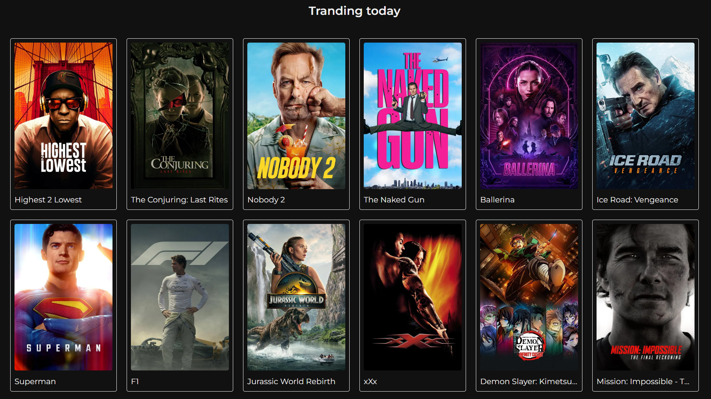
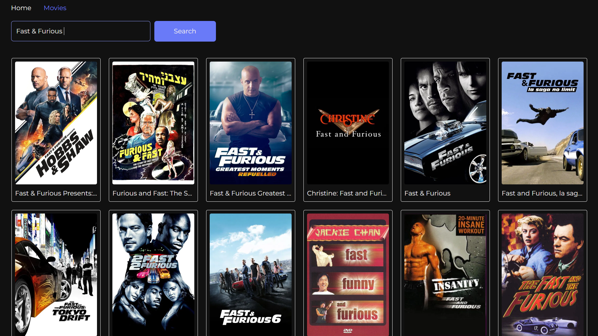
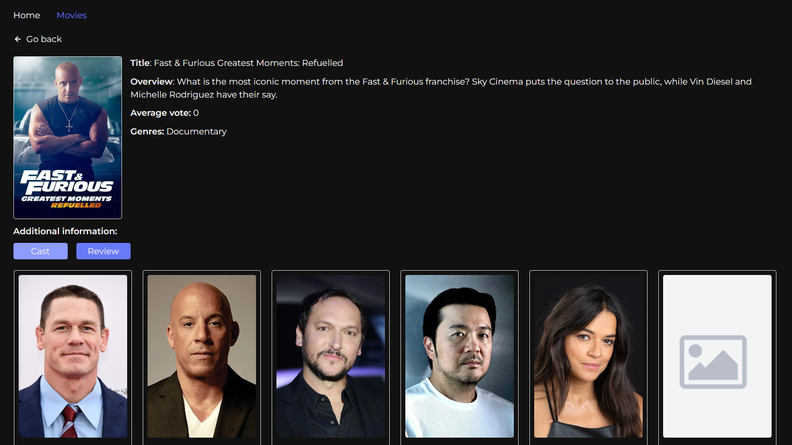
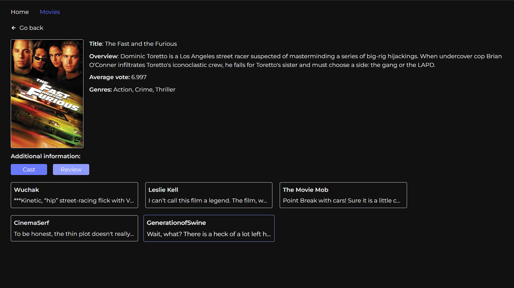

# 🧭 Movie Finder

Movie Finder is a movie search application using The Movie Database API (TMDb). You can find movies by title, view detailed information, cast and reviews.

🔗 [Live Demo](https://movie-finder-app-three.vercel.app/)  



## 🔍 Functionality:

### Search for movies by keywords



### Movie detail page



### Cast information


### User reviews



### Navigation saved on page refresh (React Router)


## ⚙️ Technologies:

- React
- React Router
- Axios
- React Suspense & Lazy
- Vite
- Yup
- React icons
- React modal
- Tailwind

---

## 🚀 Run Locally

1. Clone the repository:
   ```bash
   git clone https://github.com/sofi-dobriak/movie-finder-app.git
2. Navigate to the project folder:
    ```bash
    cd movie-finder-app
3. Install dependencies:
    ```bash
    npm install
4. Start the development server:
    ```bash
    npm run dev

---

## 💻 My other projects

### 🔎📷 Lensea — search images app

[Demo](https://lensea-search-images-ds0kw8wom-sofis-projects-f6b2a04f.vercel.app/) |
[Github](https://github.com/sofi-dobriak/lensea-search-images-app)

### 💫 Nexus — Phonebook App

[Demo](https://nexus-phonebook-app.vercel.app/) |
[Github](https://github.com/sofi-dobriak/nexus-phonebook-app)

---

👩‍💻 Author: Sofi Dobriak