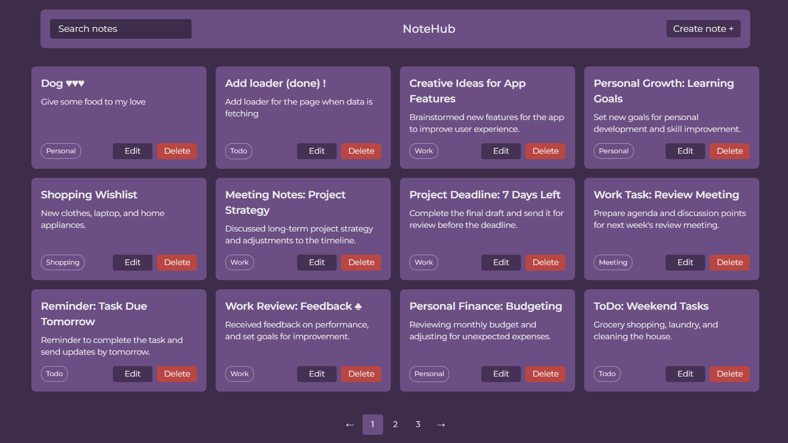
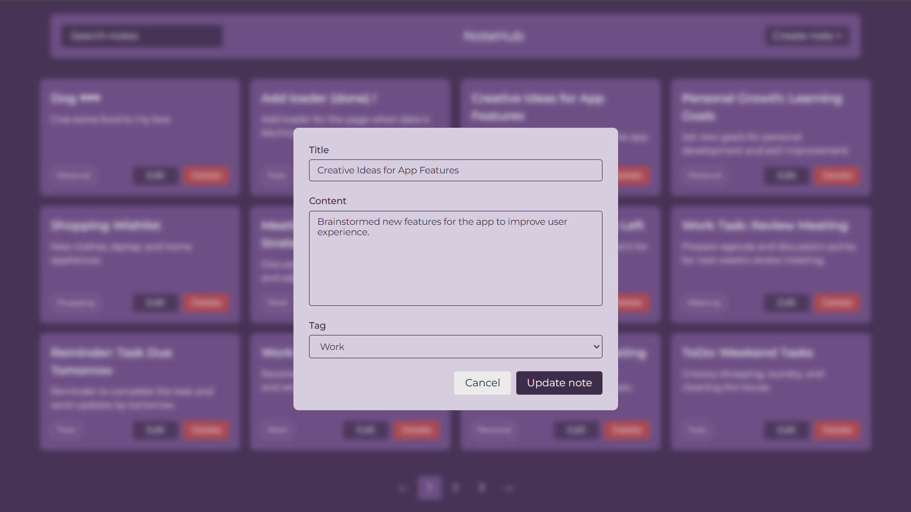
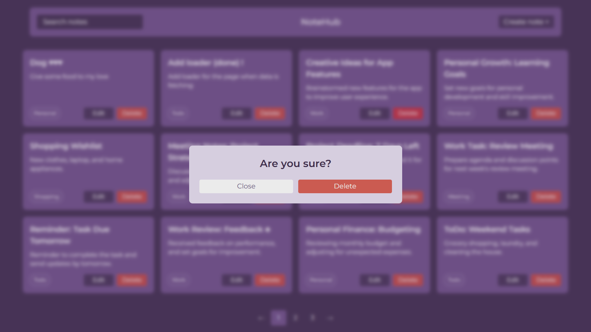
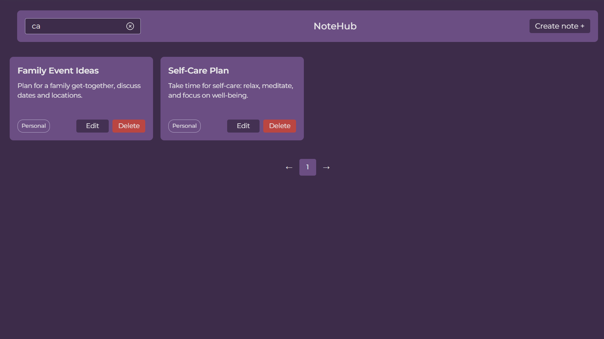

# 📝 NoteHub

A web application for creating and managing notes.
Users can create, edit, delete notes, assign categories, and keep their thoughts organized in a clean and intuitive interface.

🔗 [Live Demo](https://notehub-theta.vercel.app/)  



## 🔍 Features:

### 1. Create notes with title, description, and category


### 2. Edit notes anytime



### 3. Delete notes with a confirmation modal



### 4. Clear input button for faster editing



### 5. Smooth animations for better UX


## ⚙️ Technologies:

- React
    - React paginate
    - React response
    - React spinner
    - React icons
- TanStack
- Axios
- Vite
- Formik
- Yup
- AOS
- clsx

---

## 🚀 Run Locally

1. Clone the repository:
   ```bash
   git clone https://github.com/sofi-dobriak/notehub.git
2. Navigate to the project folder:
    ```bash
    cd notehub
3. Install dependencies:
    ```bash
    npm install
4. Start the development server:
    ```bash
    npm run dev
---

## 💻 My other projects

### "Luna" — Todo manager & Time Tracker

[Demo](https://luna-todo-manager.vercel.app/) |
[Github](https://github.com/sofi-dobriak/luna-todo-manager)

---

👩‍💻 Author: Sofi Dobriak